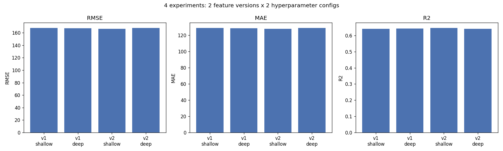
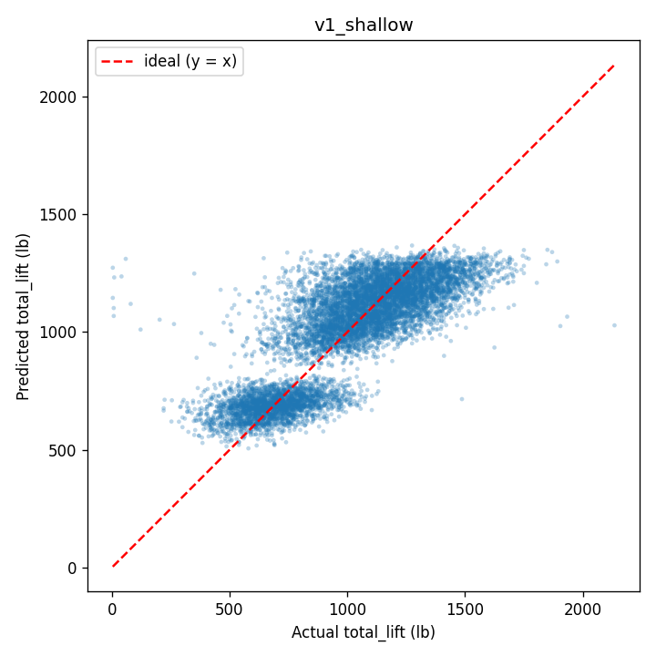
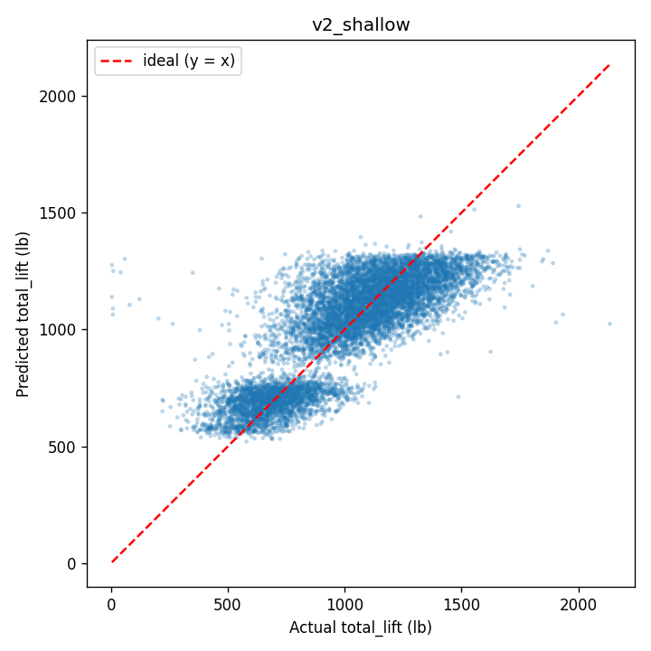

# Experiment Comparison Summary

Prediction target: **`total_lift`** (`deadlift + candj + snatch + backsq`)

We evalauted an XGBoost model across 4 experiments:
- **2 feature versions** managed as separate Feast feature views (`v1`, `v2`)
- **2 hyperparameter configs** (`shallow`, `deep`)

Every run is tracked in MLflow with its parameters, feature version, metrics, and model artifact.

## Results

Metrics are read from [`experiment_results.csv`](experiment_results.csv).

| Version | Config | RMSE (lb) | MAE (lb) | R² |
|---|---|---|---|---|
| v2 | shallow | **166.47** | **127.87** | **0.6461** |
| v1 | deep | 167.37 | 128.55 | 0.6422 |
| v1 | shallow | 167.59 | 128.83 | 0.6413 |
| v2 | deep | 167.62 | 128.79 | 0.6411 |

*(sorted best → worst by RMSE)*



## Discussion

- **Best model: `v2` + `shallow`.** This model has the lowest RMSE and MAE and highest R-squared, so the engineered features combined with the lighter, more-regularized model lead to the strongest performance.
- **Feature version effect is small but real.** Holding hyperparameters at `shallow`, moving v1 → v2 lowers RMSE from 167.59 to 166.47 and lifts R-squared from 0.6413 to 0.6461.
- **Overall spread is narrow.** All four runs land within a narrow range for RMSE and R-squared, so it is difficult to conclude that one data version x config combination is signficantly better than the others. Overall, roughly 64% of the variance in `total_lift` is explained regardless of the exact configuration.

## Per-run prediction plots

Predicted vs. actual `total_lift`; the red dashed line is the ideal `y = x`.

| v1 shallow | v1 deep |
|---|---|
|  |  |

| v2 shallow | v2 deep |
|---|---|
|  |  |

## Reproducing

```bash
python pipeline.py            # regenerates the CSV, figures, and MLflow runs
mlflow ui --backend-store-uri ./mlruns   # browse tracked parameters + metrics
```
